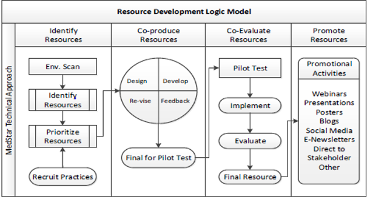

% Proposal for Resource
% Diagnostic Measurement for the Learning Health System
% An Operational Guide for Quality and Safety Leaders

# Objective

In partnership with MedStar and AHRQ, we plan to develop and pilot
test a resource that will build on the recently published AHRQ issue
brief *State of the Science for Operational Measurement of Diagnostic
Safety.* The purpose of the resource is to provide actionable guidance
and tools for defining diagnostic errors and diagnostic performance,
choosing data sources for measurement, learning from existing reports
and data sets, and overcoming barriers to measurement. The resource will
include implementation guidance and other materials necessary for
clinicians, staff, and administrators to begin or enhance their
measurement activities.

# Audience

The resource will be written for patient safety personnel, leadership,
and clinicians who seek to learn from and reduce failures in the
diagnostic process. We will aim to develop content that is relevant to
organizations with different capacities for measurement of diagnostic
safety. For example, one goal is to make the guide useful for
organizations both with and without advanced electronic health record
systems and data analytic capabilities.

# Format

The resource will be developed in the form of a toolkit that will
enable users to learn about measurement of diagnostic errors and
identify approaches to implement measurement strategies that are
appropriate to their local contexts. Some content of the resource is
modular so that organizations can choose strategies that are best suited
for their current capabilities and resources. The resource will also
incorporate case-based content; multiple cases will be used throughout
the resource to illustrate how strategies could be applied to measure
and learn from missed opportunities in diagnosis.

{width="4.23in" height="2.27in"}

# Development process

The MedStar Resource Development Logic Model (see figure below) will
guide development of the resource. An initial environmental scan has
already been completed.

We will approach the design and development of the resource iteratively,
such that at multiple points during development we will seek feedback
from stakeholders including potential organizational users and external
subject matter experts. We will solicit feedback on both overall and
section-specific form and content. Potential section-specific subject
matter experts are identified in the *Strategies* section of the proposed contents
below. Key steps include:

1.  Early in development we will engage stakeholders to reach consensus
    on the scope and general form of the resource. The initial
    stakeholder meetings will be used to create a "shared mental model"
    of the resource.

2.  Consistent with a coproduction approach, we will iteratively design
    a working draft of resource working with small groups of two or
    three people focusing on (1) the resource as a whole and (2)
    sections for which specific content expertise is needed (e.g.,
    "strategies" modules). Teams will include subject matter experts and
    representative potential organizational users for the resource.
    Their feedback (obtained using a series of coproduction sessions)
    will be used to refine the resource's content and guide development
    of the remaining content.

3.  We will present a final draft to key stakeholders and make
    additional refinements based on their feedback.

4.  We will conduct a pilot test to evaluate potential end users'
    experiences of using the resource, barriers and facilitators to
    taking acting on recommendations, and additional considerations for
    dissemination and implementation of the resource. We will select
    approximately 3 sites for pilot testing.

# Proposed Contents

## Introduction (1--2 pages)

This section provides a brief orientation to the issue of diagnostic
safety measurement and its relevance to organizations. Users are
introduced to the potential benefits of adopting strategies described in
the toolkit.

A case example will be used to engage the reader and as a recurring
element in the toolkit. Each specific measurement strategy described in
the toolkit will be explained in part through application to a case. The
case presented in the introduction describes the preventable death of a
12-year-old child with a missed diagnosis of sepsis (described in
Rogith, Iyengar, & Singh, 2017^1^). Additional case-based examples will
appear elsewhere in the resource to illustrate specific measurement
concepts.

## The Diagnostic Safety Measurement Team (1--2 pages)

This section describes the necessary conditions for using measurement
for learning and improvement. These foundational needs include dedicated
personnel and an infrastructure to analyze missed opportunities in
diagnosis than can then be used to inform recommendations to improve
care. Examples of possible team compositions and basic functions of team
members will be provided. We will also describe possible outlets by
which teams can share lessons learned from measurement and offer
suggestions for improvement. Finally, we will describe how to
effectively frame findings and recommendations for various audiences
(e.g., leadership, front-line clinicians).

This section will introduce the concept of learning health systems, a
theme that will be reinforced throughout the toolkit. Some content for
this section will be derived from the AHRQ issue brief and from the
recent publication in *Academic Medicine*, "Developing Health Care
Organizations that Pursue Learning and Exploration of Diagnostic
Excellence: An Action Plan."^2^

## Organizational Self-Assessment (1 page)

Users will be prompted to answer a brief set of questions in order to
help select what diagnostic safety measurement strategies may be most
appropriate to their local context. Users will identify, for example,
whether their organizations have existing safety event reporting systems
or protocols, whether their organizations have electronic record systems
that can be queried for surveillance of possible diagnostic safety
events and what type of human resource capability do they have to make
sense of the data. Based on these responses, users will be guided toward
specific measurement strategies for implementation.

## Strategies

Each strategy is a brief (\~1--2 pages) and practical guide for
implementing methods to identify potential missed opportunities in
diagnosis for the purposes of learning and improvement. Case examples
will be used to illustrate applications of these strategies.

Strategies that are described in these modules have been selected both
for potential yield of actionable information and readiness for
implementation, as described in the recent AHRQ issue brief. We will
engage subject matter experts to review and provide recommendations for
implementing the strategy described in each module. Instruments for data
gathering and synthesis will be referenced across relevant modules and
included as printable, ready-to-use tools in Appendices.

### Using Data from Existing Organizational Data Sources

Using a "how-to" approach, we will highlight how all institutions can
evaluate and learn from diagnostic safety events that are documented
in existing data sources including peer review processes, morbidity
and mortality rounds, autopsies, and malpractice claims. This section
will describe processes for generating data for learning and
improvement from these sources. Tools from published literature^3,4^
will be referenced as examples of structured data gathering methods.

-   Potential SMEs: Geisinger, Baystate, CHOP, M&M placeholder

### Brief Reports from Clinicians and Patients

Generic incident reporting systems may be insufficient for capturing
diagnostic safety events. This module will use our "how-to" approach
to describe best practices for soliciting and following up brief
reports of diagnostic safety events from clinicians. To make it more
pragmatic, a prototype reporting tool will be provided.

This module will also describe emerging methods to solicit and
investigate reports of diagnostic safety events that are initiated by
patients. Even though research is early, we will highlight some
suggestions for engaging patient advocates and other staff who may
encounter patient concerns about care safety and quality.

-   Potential SMEs: Trisha Marshall (Cincinnati Children's Hospital),
    Traber Giardina, Kelly Smith

### Electronic Health Record-Enhanced Chart Review

Search queries of electronic health records can be used to identify
cases of diagnoses that are at high risk of being missed or delayed,
which can then be reviewed for learning and improvement opportunities.
This "how-to" approach will use examples of certain "high-risk"
diagnoses already identified in the literature on diagnostic errors
(e.g., spinal epidural abscess^5^). We will also make recommendations
for selecting other high-risk diagnoses for routine record review
based local priorities, frequency, and potential for harm.^6^ Users
will be oriented to existing tools (such as the Revised Safer Dx
Instrument^7^) to evaluate the diagnostic process in selected records.

This module will give a pragmatic overview of different steps involved
in querying electronic health records to identify events or patterns
of care that may signal diagnostic error. We will introduce the Safer
Dx Trigger Tools Framework for developing and implementing electronic
triggers to identify diagnostic errors and processes to evaluate cases
identified using EHR-based methods.^8^

-   Potential SMEs: Daniel Murphy, Dean Sittig, Robert El-Kareh

## Additional Resources and References

This section will include references, an annotated resource list for
additional learning, and appendices that include case review tools that
can be printed for "off-the-shelf" use.

1. Rogith D, Iyengar MS, Singh H. Using Fault Trees to Advance
Understanding of Diagnostic Errors. *Jt Comm J Qual Patient Saf.*
2017;43(11):598--605.

2. Singh H, Upadhyay DK, Torretti D. Developing
Health Care Organizations That Pursue Learning and Exploration of
Diagnostic Excellence: An Action Plan. *Acad Med.* 2019.

3. Manaseki-Holland S, Lilford RJ, Bishop JRB, et al. Reviewing deaths in
British and US hospitals: a study of two scales for assessing
preventability. *BMJ Qual Saf.* 2017;26(5):408--416.

4. Eichbaum Q, Adkins
B, Craig-Owens L, et al. Mortality and morbidity rounds (MMR) in
pathology: relative contribution of cognitive bias vs. systems failures
to diagnostic error. *Diagnosis (Berl).* 2019;6(3):249--257.

5. Bhise V,
Meyer AND, Singh H, et al. Errors in Diagnosis of Spinal Epidural
Abscesses in the Era of Electronic Health Records. *Am J Med.*
2017;130(8):975--981.

6. Olson APJ, Graber ML, Singh H. Tracking Progress
in Improving Diagnosis: A Framework for Defining Undesirable Diagnostic
Events. *J Gen Intern Med.* 2018;33(7):1187--1191.

7. Singh H, Khanna A,
Spitzmueller C, Meyer AND. Recommendations for using the Revised Safer
Dx Instrument to help measure and improve diagnostic safety. *Diagnosis
(Berl).* 2019;6(4):315--323.

8. Murphy DR, Meyer AN, Sittig DF, Meeks DW,
Thomas EJ, Singh H. Application of electronic trigger tools to identify
targets for improving diagnostic safety. *BMJ Qual Saf.*
2019;28(2):151--159.
